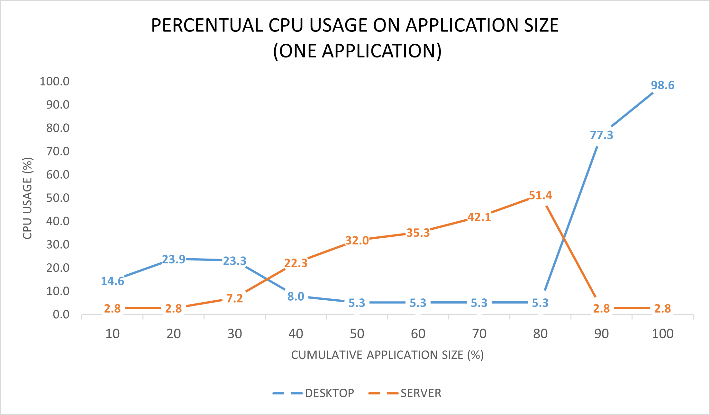
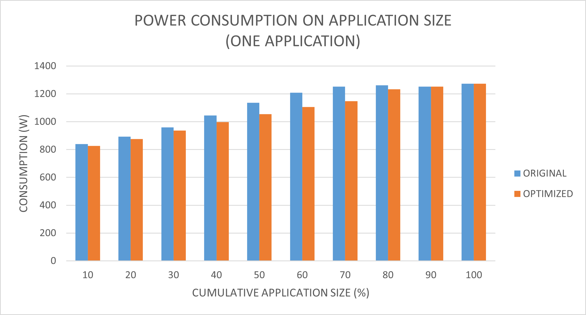
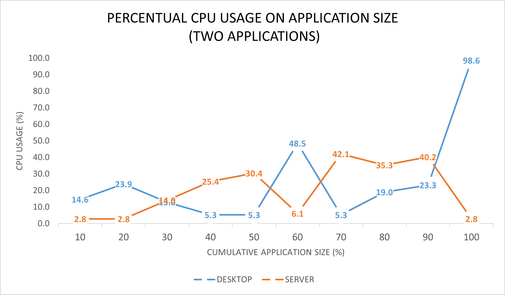
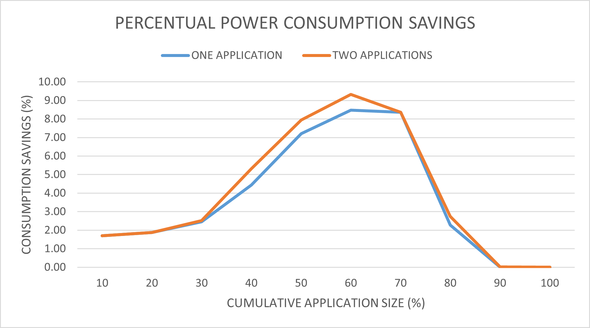

# REPORT SUI PRIMI RISULTATI
L'obiettivo di questi test è quello di investigare per cercare di capire se l'approccio coudificato di condivisione delle risorse e tutti i relavi vantaggi in termini di risparmio di risorse computazionali e energetiche possa applicarsi anche in scenari edge-like, caratterzzati da dispositivi general purpose e con capacità computazionali limitate.

A questo proposito è stato sviluppato un simulatore che, a partire da un'infrastruttura eterogenea di dispositivi e un set di workload da schedulare, è in grado di identificare la soluzione di scheduling ottimale dal punto di vista del consumo energetico.

## DESCRIZIONE DEI TEST
I test sono stati fatti su un'infrastruttura di dimensioni fisse, andando a differenziare il carico da schedulare. In particolare tale infrastruttura è caratterizzata da:

 - 20 postazioni desktop (modellati prendendo come riferimento una macchina desktop di laboratorio)
 - 10 server (modellati prendendo a riferimento una macchina presente nella sala server del laboratorio)

Su questa infrastruttura fissa sono stati definiti due tipi di test in modo tale da identificare i possibili vantaggi di un approccio cloudificato al variare del carico applicato al sistema. In particolare si è voluto investigare in che modo 1) la dimensione e 2) il numero delle applicazioni da schedulare possa influenzare la soluzione ottimale di scheduling. In particolare dello scenario analizzato le 20 macchine desktop sono quelle che hanno la possibilità di spostare il proprio carico all'interno dell'infrastruttura, mentre le postazioni server hanno l'unico scopo di fornire all'occorrenza capacità computazionali.

## UNA APPLICAZIONE
Questa tipologia di test permette di capire come impatta la dimensione delle applicazioni da schedulare sul consumo complessivo della soluzione di scheduling. In particolare nei due grafici successivi sull'asse delle ascisse andiamo a rappresentare la dimensione in percentuale delle applicazioni da schedulare; tale percentuale viene calcolata a partire dal quantitativo di risorse disponibili nelle macchine desktop. Per esempio un valore di 20% che possiamo riscontare nei grafici corrisponde ad uno scenario in cui tutte le macchine desktop hanno un workload da spostare, corrispondente al 20% delle loro risorse disponibili.

Il primo risultato che andiamo ad analizzare è il consumo di risorse CPU nei due tipi di dispositivi; in particolare andiamo ad evidenziare il consumo percentuale di CPU rispettivamente per le postazioni desktop e per i server.

Come si può notare dal grafico successivo per applicazioni di piccole dimensioni da spostare (fino al 20%) si ottiene che la soluzione migliore di scheduling prevede l'utilizzo esclusivo di risorse desktop; all'aumentare della dimensione delle applicazioni si evidenzia come la soluzione migliore di scheduling prevede l'uso (quasi sempre esclusivo) di risorse server, fino alla soglia critica di 80%, oltre la quale le risorse messe a disposizione dal server non garantiscono l'ottimalità della soluzione. Tale comportamento è dovuto alla funzionalità di hyperthreading del server: se si considera la solgia critica dell'80% si può vedere come l'occupazione delle risorse del server sia del 51,4%. Ciò significa che in tale configurazione sono stati riservati tutti i core fisici messi a disposizione del server, lasciando "liberi" quelli virtuali. Aumentando ulteriormente la dimensione delle applicazioni da schedulare al 90% la scelta di scheduling sul server prevederebbe l'uso dei core virtuali, i quali garantiscono un aumento delle prestazioni del sistema rispetto ai soli core fisici, ma che tuttavia comportano un consumo energetico aggiuntivo non in linea cone l'aumento delle prestazioni.

## DUE APPLICAZIONI

## COMPARATIVA

# NOTE:
Nella definizione dell'infrastruttura non mettere il "-" nel nome dei device